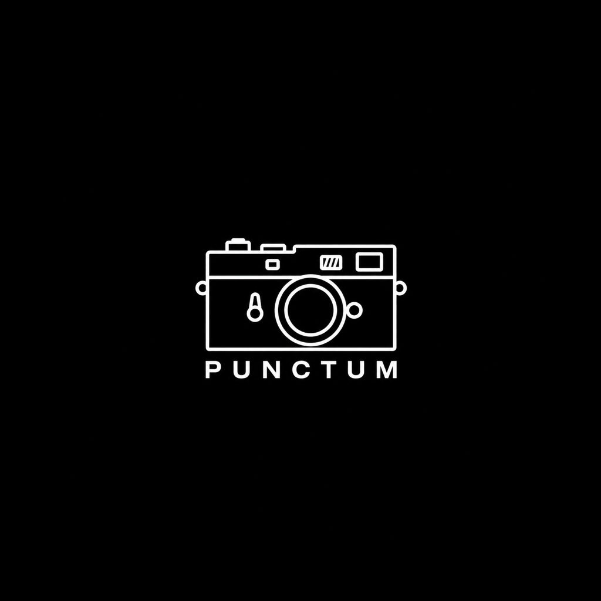

<p align="center">
  
</p>

<h1 align="center">Punctum · 观止</h1>

<p align="center"><strong>为回看而生的影像画廊</strong></p>

> **Punctum 是一款致力于为影像爱好者提供充足情绪价值的软件。你可以像翻阅一本大师摄影杂志一样，浏览和回看自己的作品，并通过自然的手势快速取舍、整理照片，让每一次回望都重新感受到影像的重量。**

我们希望把相册从普通的图片容器，变成一座属于每个人自己的影像画廊。照片保留原本的比例、拍摄时间、地点和影像参数，以更接近摄影画册与展览的方式被重新观看；首页、画廊和大图页也围绕“浏览、感受、取舍”这条路径展开。

Punctum 直接映射设备里的系统图集，照片仍由系统相册管理。你可以把不同主题的照片分别组织成一座座画廊，在回看中完成筛选、移动与删除。


## 双端最新验收与发布 · 2026-10-10

用户已明确将近期 Android 与 iOS 改动全部视为验收通过。版本保持 **Android 0.5.9/59、iOS 0.5.10/60**；本次授权将全部近期源码、资源、测试、构建配置和说明同步到 GitHub `main`。最新功能、安装包和验证范围见 [本次发布汇总](docs/RELEASE_VALIDATION_2026-10-10.md)。下方旧“待验收”“未提交／未上传”、空 IPA 目录及旧测试数量均为各自日期的历史记录；用户验收状态以本节为准。未执行的测试或真机操作保留原证据边界。

## iOS 后台恢复与重复删除修复 · 2026-10-10

iOS **0.5.10/60** 本地修复：观止的删除确认完整退出后再请求系统删除；切后台保留待确认批次，回前台恢复确认；删除动效被打断时恢复照片与手势，已松手确认的动作只处理一次。当前图集的拍摄、编辑、同步三种模式均在回前台异步读取最新列表；列表长按与大图批量删除共用串行提交，删除前重新解析照片标识，系统成功后核对照片已移除，再更新列表。

新增 8 项回归，最终 **66 项 XCTest 全通过，0 失败、0 跳过**；iPhone arm64 Release、IPA ZIP、应用标识及包内版本检查通过。最新本地包 `iOS/IPA/Punctum-0.5.10-foreground-delete-fix-unsigned.ipa`，SHA256 `eee2d1d08c9092fecb46cabf388fbffc42432227490f7eea500ffc1e5d0cac9b`，沿用 AltStore 签名安装。

本轮未连接到可用 iPhone，未覆盖安装。用户原图库的“列表切回卡住”和“首次删图后切后台、再次删图没有系统确认”仍需真机复测；弹窗回归验证了 UIKit 退出完成后的提交回调，PhotoKit 集成验证了真实图集重排/移除成员及三种模式前台刷新，尚未在真实 iPhone 驱动连续两轮系统删除确认。Android 保持 **0.5.9/59**，本轮未改；全部已有本地改动保留，无升号或上传。详细验证见 [后台恢复与删除验证](docs/IOS_FOREGROUND_DELETE_VALIDATION_2026-10-10.md)。

## Android 保留缩放 · 2026-10-10

Android **0.5.9/59** 大图已支持松手保持倍率与位置、放大后单指移动、双击复原；最大 5 倍。放大期间避免误触翻页/删除/Live Photo，复原后恢复原操作；返回或切后台清理缩放。iOS **0.5.10/60** 未改。

最新 APK `APK/Punctum-0.5.9-retained-zoom.apk` 已保留数据安装 OPPO PMA110，设备拉回包与本地哈希一致：`668d95dae00985b33cb62c3673392a3a5230ba706283495bf774fd55fdb5aad0`。34 项单测、Release、Lint（0 错误/17 条既有警告）、签名通过，真机横竖图保持/移动/复原、切后台及返回列表已验证；本次手感尚待用户确认。此前新用户标题字号源码跟进也纳入此包，未清数据测试开屏。

本轮保留全部已有改动，版本不变，没有提交上传。最新接续见 [10 月 10 日交接](SESSION_HANDOFF_2026-10-10.md)，具体范围见 [保留缩放验证](docs/ANDROID_RETAINED_ZOOM_VALIDATION_2026-10-10.md)。下方“最新包”和旧松手回弹行为按历史阶段理解。

## 历史交接状态 · 2026-10-08

最新接续以 [10 月 8 日交接](SESSION_HANDOFF_2026-10-08.md) 为准，给新 AI 的 [视觉评估 prompt](docs/GALLERY_VISUAL_REVIEW_PROMPT_2026-10-08.md) 已整理。下一步先评估进入图集后的照片列表页，等用户选择方案再改代码。

- **Android 0.5.9/59**：5 倍缩放、350ms 整体进出、返回文字淡出裁切、去风格和排序右下已获用户确认；新用户标题单行为后续源码跟进，未重新打包安装。
- **iOS 0.5.10/60**：同步排序、当前图集前台刷新、4 秒完整提示及导航取消、标题单行、删除后照片身份修复均在本地；仍保留排序/风格两行。最终 58 项测试通过为 10 月 6 日模拟器结果，原 iPhone 图库同步和删图后点击仍待验收。
- 10 月 8 日复核：Android 最新本地 APK 仍存在且哈希不变；**iOS/IPA 目录当前没有 IPA**，下方旧包路径与哈希仅是历史交付记录。私有截图与原始测试结果仍在本机忽略目录。
- 本地 HEAD 与 GitHub main 均为 `aaaa86be14187401312e98e33e80634cc24a2da8`；10 月 6 日跟进及本轮文档仍未提交上传。全部已有改动保留；本轮只更新文档，没有改源码、版本、打包或重跑应用测试。

下方有日期的“最新”“当前”“待验收”和包状态按各阶段理解；旧 Android 待确认状态已由用户确认取代。

## 历史 iOS 修复 · 删除后点击错位 · 2026-10-06

iOS 仍为 **0.5.10/60**，修复删除返回后列表显示与点击照片可能错位的问题。最新修复包 `iOS/IPA/Punctum-0.5.10-delete-identity-fix-unsigned.ipa`（未签名，使用 AltStore）；58 项测试全部通过、0 跳过，Release 与包检查通过。删除后重新配对、延迟点击、返回定位及真实 RootView 再次打开已在模拟器覆盖，用户原图库仍待 iPhone 复核。Android 0.5.9/59 保留，全部本地改动保留，未提交或上传。详见 [修复验证](docs/IOS_DELETE_IDENTITY_VALIDATION_2026-10-06.md)。下方包和测试状态为此前阶段记录。

## 当前版本 · 2026-10-06

| 平台 | 版本 / 构建号 | 当前状态 |
|---|---|---|
| iOS | **0.5.10 / 60** | 新增系统图集「同步」排序、前台刷新、4 秒完整提示；新用户标题完整单行 |
| Android | **0.5.9 / 59** | 已验收的缩放、动效和排序位置跟进保留，本轮暂不升号 |

最新 IPA：`iOS/IPA/Punctum-0.5.10-unsigned.ipa`（未签名，使用 AltStore）。Release 构建、包完整性及包内版本检查通过。

本次仅 iOS 升级。用户可在系统相册调整图集自定义位置，再切回观止刷新当前同步图集；各图集排序独立保存。完整说明见 [iOS 更新日志](changelog/ios.md)，打包验证见 [0.5.10 验证](docs/IOS_RELEASE_VALIDATION_2026-10-06.md)。真实图库同步仍待 iPhone 验收；没有再次提交上传。下方为此前阶段记录。

## 新增本地跟进 · iOS 同步排序 · 2026-10-06

用户已明确确认 Android 最新本地改动全部验收通过。iOS 本轮新增「拍摄／编辑／同步」三模式；同步保留系统图集自定义位置，回到前台直接刷新当前图集，无需退出重进。首次提示使用用户完整三模式文案、4 秒，退出图集或进入大图立即取消；看过旧提示的用户可再看到一次新说明。

两端仍为 0.5.9/59。iOS 新包为 `iOS/IPA/Punctum-0.5.9-sync-sort-unsigned.ipa`，Release 与包完整性检查通过；真机验收待执行。进出动效与去风格布局仍未同步 iOS。详细实现和测试范围见 [iOS 同步排序验证](docs/IOS_SYNC_SORT_VALIDATION_2026-10-06.md)。本轮未提交上传，全部原有本地改动保留。下方为此前阶段记录，其「iOS 本轮无源码修改」与「Android 最新验收待确认」表述已由本节更新。

## 前一阶段接续 · 2026-10-06

两端均为 **0.5.9/59**。Android 本地跟进包含最大 5 倍缩放、350ms 图片与文字整体进出、返回文字同步淡出及裁切；列表头部已移除风格词条，将「排序 · 拍摄／编辑」移到右下，与照片数量对齐。每图集排序独立记忆、首次 2 秒提示、真实拍摄日期及来源位置返回规则保留。

最新本地 APK 为 `APK/Punctum-0.5.9-sort-only-header.apk`，已保留数据安装 PMA110 并核对设备一致，Release 通过且截图核对排序位置正确。此前返回修正 Release/Lint 与横竖图逐帧检查通过；用户已在本次接续明确确认 Android 全部本地跟进没问题。完整回归的最近记录是整体返回阶段 28 项单测通过，不能说最后一次仅排版改动重跑了全部检查。

iOS 新增「拍摄／编辑／同步」三模式与完整 4 秒提示，同步模式回到前台直接刷新系统图集位置顺序；仍保留「排序」在「风格」上方的布局，新增进出动效尚未移植。最新 IPA `iOS/IPA/Punctum-0.5.9-sync-sort-unsigned.ipa`；Release/包检查及 50 项测试通过，1 项 PhotoKit 集成因模拟器权限跳过，真实图库同步待 iPhone 验证。

GitHub `main` 当前为 `aaaa86b`（10 月 5 日发布及上传核验），本地上述后续改动与最新文档尚未再次提交上传。新对话从 [2026-10-06 交接](SESSION_HANDOFF_2026-10-06.md) 开始；详见 [验证汇总](docs/ANDROID_LOCAL_FOLLOWUP_VALIDATION_2026-10-06.md)、[Android 日志](changelog/android.md)、[iOS 日志](changelog/ios.md)。下方旧日期内容保留为历史记录。

## 上次发布记录 · 2026-09-20

- **iOS 0.5.9 / 59**：新增大图对比模式，支持系统单选、横竖布局、独立/联动缩放及删除返回；同时包含1–5倍保留缩放、批量删除性能和连续翻页续载修复。
- **Android 0.5.8 / 58**：包含按进入时可见范围判断的返回定位、返回闪动修复、缓存合并写入、按实际尺寸解码、逐张高清发布及异常预览比例修复。首次进入图集支持可取消加载，超过500ms才显示居中小卡片，完成即关闭。
- 当时的安卓本地包：`APK/Punctum-0.5.8-delayed-loading.apk`，曾覆盖安装PMX110；当时的 iOS 包：`iOS/IPA/Punctum-0.5.9-unsigned.ipa`。
- 当前实现与待验收项见本节及 `SESSION_HANDOFF_2026-09-20.md`。下方旧日期内容为历史记录，旧“最新包”“未提交上传”及版本号均按当时范围理解。
- 发布源码、资源、测试、构建配置与文档到GitHub；安装包、签名凭据和含用户照片/URI的原始录屏与设备日志仅留本机。公开验证摘要见 `docs/RELEASE_VALIDATION_2026-09-20.md`。

## 核心体验

- **像翻阅摄影杂志一样回看作品**：用克制的排版、完整的画幅和富有纸张触感的视觉语言，让自己的照片成为观看主体。
- **三种首页邀请卡**：在明信片、票据、反转胶片之间切换，同一座画廊可以拥有不同的封面表达。
- **保留照片原始比例**：画廊列表按照照片真实画幅排布，横图、竖图和带白边作品都能完整呈现。
- **用手势快速取舍**：在大图页点击左右边缘快速切换照片，上滑加入本次待删除队列，退出大图后统一确认；长按缩略图也可以发起删除。
- **支持实况影像**：Android Motion Photo 与 iOS Live Photo 均可在大图页按住播放，也可以点击实况角标完整播放一次。
- **看见照片背后的信息**：大图页展示拍摄时间、地点、设备、快门、ISO、光圈、分辨率与文件体积。
- **联动系统图集**：支持多选添加多个图集、调整画廊顺序，以及把照片移动到其他图集；已经加入 Punctum 的图集会在选择面板中显示「已添加」并锁定。
- **切换照片排序**：Android 列表右下「排序 · 拍摄／编辑」一点切换，与照片数量同一行；iOS 在风格词条上方切换「拍摄／编辑／同步」。每图集独立记忆，拍摄与编辑模式最新在前，同步模式使用系统图集的位置；大图日期保持真实拍摄时间。
- **顺手管理画廊**：长按图集整行即可拖动排序，列表支持内部滚动、跨页自动滚动和滚动位置提示。

## 三种首页风格

| 风格 | 视觉表达 | 封面规则 |
|---|---|---|
| 明信片 | 四图拼贴、奶油色卡纸与牛皮纸票尾，像一张寄给自己的影像明信片 | 最新四幅作品 |
| 票据 | 真实纸纹、主色票根、齿孔、编号与条形码，像一张进入私人摄影展的门票 | 最新一幅作品 |
| 反转胶片 | 正方形胶片卡、下沉画幅与克制标题，向幻灯片和反转片观看方式致意 | 最新一幅作品 |

三种风格使用同一套照片排序结果：Android 所有图集优先采用文件内 EXIF 原始拍摄时间，再回退到系统媒体库时间和文件时间。大图页显示、拍摄模式列表排序、图集跨度及封面选择使用同一时间来源；Android 图集可独立切换为修改时间排序。Phocus 与 DJI Album 已在用户手机逐张核对 755 张照片，原始时间与应用记录全部一致。

## 画廊与大图

进入画廊后，照片以接近原始画幅的双列形式连续排布。新的作品位于前方，列表保持紧密、安静，让视线停留在影像本身。

点开作品后进入沉浸式大图页：

- 单击画面，在沉浸观看与操作状态之间切换。
- 单击左右边缘，快速切换前一幅或后一幅作品。
- 上滑卡片并松手，加入本次待删除队列；退出大图时统一确认，取消则保留照片。iOS 使用原生快照和 280ms 收缩动效。
- iOS 支持 1–5 倍双指缩放，松手保留大小与位置，可单指或双指四向拖动；双击放大图片任意位置，或捏合缩回 1 倍，即可复原。Android 支持 1–5 倍双指缩放、平移和松手回弹。两端参数区均保持原位。
- iOS 右上角双图入口支持选择另一张照片对比：两竖图左右排，其余上下排；可独立或联动缩放，并在确认后删除其中一张。
- 点击右上角移动入口，可以把当前照片移动到其他系统图集。
- 实况照片支持按住播放、松手停播，以及点击角标完整播放。
- 图片下方保留摄影作品编号和完整拍摄信息。

图集排序弹窗支持长按拖动和触觉反馈；内容超出范围时在面板内滚动。iOS 排序列表优先响应上滑，并使用面板可用高度。

## 当前版本

README 更新于 2026-10-06。Android **0.5.9 / 59**，iOS **0.5.9 / 59**。

| 平台 | 版本 | 构建号 | 当前确认状态 |
|---|---:|---:|---|
| Android | `0.5.9` | `59` | 发布后本地跟进：5 倍缩放、返回淡出裁切、排序移到右下；用户已确认全部本地跟进 |
| iOS | `0.5.9` | `59` | 新增同步排序与 4 秒提示；50 项通过/1 项权限跳过，真机同步待验收 |

近期还修复了 iOS 大图集进入等待、竖图显示、翻页回弹、EXIF 预读、邀请卡滑动误触、后台恢复和排序面板滚动。各项实现与验收边界见[更新日志](changelog/ios.md)和[交接文档](PUNCTUM_HANDOFF.md)。

Android 与 iOS 已对齐首页三态、系统图集映射、原比例画廊、大图信息、实况播放、照片移动和删除等主要体验。平台底层分别遵循 Android MediaStore / Motion Photo 与 iOS PhotoKit / Live Photo 的原生机制。

## 项目结构

```text
Punctum/
├── app/                         # Android 应用源码与资源
├── iOS/Punctum/                 # iOS 工程、Swift 源码与构建脚本
├── PRD/                         # 产品需求文档
├── design/                      # 字体、图标与交互演示
├── 设计稿/                       # 视觉参考与设计稿
├── changelog/                   # Android / iOS 分平台更新日志
├── design-qa.md                 # 最近一轮视觉与交互验收记录
├── PUNCTUM_HANDOFF.md           # 当前实现、保护项与接续开发说明
└── CHANGELOG.md                 # 当前版本与更新索引
```

## 本地开发

### Android

- 使用 Android Studio 打开仓库根目录。
- 调试构建：`./gradlew assembleDebug`
- 正式构建：`./gradlew assembleRelease`
- 应用包名：`com.punctum.gallery`

正式签名需要本机的 Android 签名文件与密码配置。签名资料不会进入 GitHub。

### iOS

- 工程目录：`iOS/Punctum`
- 必要时先执行 `xcodegen generate`，再打开 `Punctum.xcodeproj`。
- 最低系统版本：iOS 17
- Bundle Identifier：`com.chessyyq.punctum`
- 未签名 IPA 构建脚本：`iOS/Punctum/scripts/build-unsigned-ipa.sh`

真机分发需要 Apple 开发者证书和对应的 Provisioning Profile，这些签名资料需要通过安全方式单独迁移。

## 安装包与源码接续

APK 和 IPA 属于可重复生成的本地构建输出，不纳入 Git。仓库保留完整源码、资源文件、构建脚本、版本配置和更新记录，因此换电脑后可以继续开发并重新生成安装包。

## 文档与更新记录

- [当前版本与更新索引](CHANGELOG.md)
- [开发交接文档](PUNCTUM_HANDOFF.md)
- [验证与历史迭代记录](design-qa.md)
- [Android 完整更新日志](changelog/android.md)
- [iOS 完整更新日志](changelog/ios.md)
- [更新日志维护规则](changelog/README.md)
- [Punctum 产品需求文档](PRD/PRD-Punctum观止.md)

---

**Punctum 关心每一幅照片被重新看见的时刻。**
